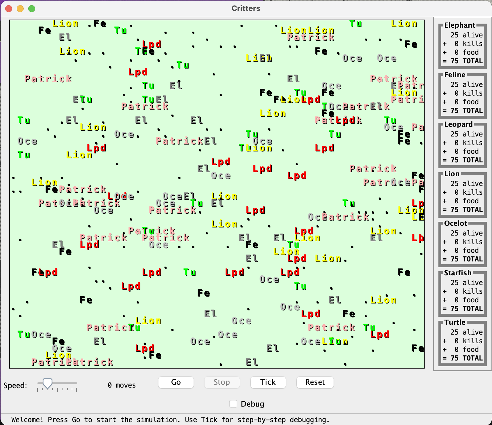
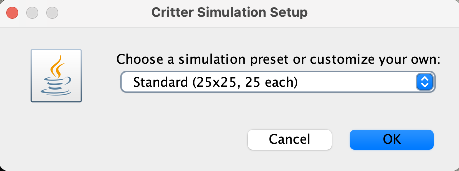
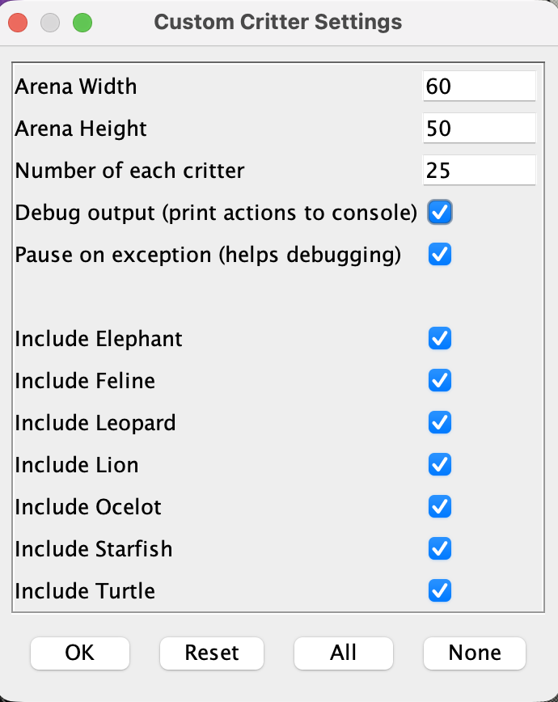

# CSE 11 Fall 2025 PA7 - Critter and Inheritance

**Due date: Tuesday, December 2 @11:59PM PDT**

**Download the starter code from GitHub by clicking: Code $\rightarrow$ Download ZIP**

## Provided Files

The following files are provided:

* `Critter.java`: prototype of a critter object, contains the Critter class and enums Direction and Attack.
* `Starfish.java`: Patrick Star, he lives in Bikini Bottom.
* `Feline.java`: starter code for Feline.
* `CritterInfo.java`: provides context about the Critter and the current simulation. (**Please read the method headers provided to gain a better understanding.**)
* `CritterGUI.jar`: A GUI simulator for your classes with helpful debugging features.

**Note:** the starter codes do not compile by doing `javac *.java` because they are not completed. When you complete a class, you should write a tester to test your individual methods in that class. In the end, you can use `CritterGUI.jar` to run the simulation.

## Goal
Programming Assignment 7 is an introduction to inheritance in Java. In this assignment, you will write several classes for various critters who will face off against each other in an arena.

## Overview

Critter [Gradescope, 100 points]

- Implementation [95 points]
- Style [5 points]

## Arena & Simulation Mechanics

Several classes in the starter code implement a graphical simulation of a 2D world with many animals moving around in it. You will write a set of classes that define the behavior of these animals. For each class, you are defining the unique behaviors for each animal. 

The Critter World is divided into cells with integer coordinates. The world is 60 cells wide and 50 cells tall by default. The upper-left cell has x-coordinates and y-coordinates (0, 0). The x-coordinate **increases to the right**. The y-coordinate **increases downwards**. 



**NOTE: the following mechanics are already implemented in the Critter simulator, e.g. when two critters fight, the simulator decides who wins based on what the attack each critter uses. Your task for this assignment is to define behaviors for each critter. i.e. you just need to write the methods but don't need to call them.**

You can run the simulator to test your critter implementations.

### Movement

When it's Critter A's turn to move, the simulator will call `A.getMove()` to get a direction.

Each round, each Critter can move one square north, south, east, west, OR stay at its current location (i.e. center). The world has a finite size, but it wraps around in all four directions (for example, moving east from the right edge brings you back to the left edge).

### Fighting

As the simulation runs, animals may collide by moving onto the same location. When two animals collide and they are from different species, they fight. The simulator will call `getAttack()` so that the critter fighting can select which attack to use.

The winning animal survives and the losing animal is removed from the game. Each animal chooses one of `Attack.ROAR`, `Attack.POUNCE`, `Attack.SCRATCH`, or `Attack.FORFEIT` as their attack mode. Each attack will have some other attack that it is stronger against (e.g. Roar beats Scratch). If an animal decides to Attack.FORFEIT, it will automatically lose the fight.

The following table summarizes the choices and which animal will survive in each case. To remember which beats which, notice that the starting letters of "Roar, Pounce, Scratch" match those of "Rock, Paper, Scissors." If the animals make the same choice, the winner is chosen with a coin flip.


The cases above are based on the following rules:

1. Critter #1 scratches and Critter #2 roars. Critter #2 survives.
1. Critter #1 roars and Critter #2 pounces. Critter #2 survives.
1. Critter #1 pounces and Critter #2 scratches. Critter #2 survives.
1. Critter #1 and Critter #2 use a same attack in [roar, pounce, scratch, forfeit]. One of them survives, chosen randomly.
1. Critter #1 uses an attack in [roar, pounce, scratch] while Critter #2 forfeits, Critter 1 survives.

### Mating

If two animals of the same species collide, they "mate" to produce a baby. Animals are vulnerable to being attacked while mating, so any other animal that collides with them will defeat them both. An animal can mate only once during its lifetime. A "baby" will be spawned as a full adult next to its parents once they are finished mating.

The mating behavior is enforced by the simulator. However, when two critters mate, `mate()` will be called so that your critter knows it starts mating.

### Eating and Sleep

The simulation world also contains food (represented by the period character ``"."``) for the animals to eat. There are pieces of food on the world initially, and new food slowly grows into the world over time. As an animal moves, it may encounter food, in which case the simulator will ask your animal whether it wants to eat it. Different kinds of animals have different eating behavior: some always eat, and others only eat under certain conditions. Once an animal has eaten a few pieces of food, that animal will be put to "sleep" by the simulator for a small amount of time. During the sleeping period, the animal will automatically forfeit all fights, meaning it will lose to all other critters that attack it.

When a critter encounters food, the simulator will call `eat()` to ask whether the critter wants to eat or not.

The sleep behavior is enforced by the simulator. However, when a critter sleeps, `sleep()` will be called so that your critter knows it starts sleeping. Similarly, `wakeup()` will be called when your critter finishes its nap.

### Scoring

The simulator keeps a score for each class of animal, shown on the right side of the screen. A class's score is based on how many animals of that class are alive, how much food they have eaten, and how many other animals they have defeated. Detailed formula below:

```
Score = 3 x Survivor + 3 x Killed_Opponents + 1 x Food_Eaten
```

## Implementation Details

Each class you write in this section will inherit from a superclass (`extends`)  and may be inherited by a subclass. We take advantage of inheritance in two ways: 

* Since subclasses automatically inherit certain methods from their superclass, if we want a certain method to be uniform across a family of classes, we can simply define the method in the superclass. 
* The other advantage is that we can minimize the amount of code that we have to write, which reduces the possibility of errors. Inheritance provides the programmer assistance in streamlining the code writing process.

Below is a diagram for the Critter World. Critter is an abstract class and you can read more about abstract classes [here](https://docs.oracle.com/javase/tutorial/java/IandI/abstract.html).  All the other critters/animals are implemented as **concrete classes** (meaning they can be instantiated by using the `new` keyword).

Each class must extend Critter (or something else that extends Critter). 


### Running the Simulator

Note: Don't try doing this before you have implemented the files. It will not even compile.

We will now go through the process of running the simulator. First compile all the necessary classes (note: `Starfish.java` and `Feline.java` as it is provided will not compile). You can compile separately if needed, but `javac *.java` is most convenient. Next, run the simulator with `java -jar CritterGUI.jar`. 

#### Simulator Features

**Preset Configurations**: When you first run the simulator, you'll be prompted to choose a preset:



- **Quick Test** (10x10, 5 critters) - Perfect for rapid testing during development
- **Standard** (25x25, 25 critters) - Balanced simulation for general testing
- **Full Battle** (60x50, 50 critters) - Large-scale simulation for final testing
- **Custom...** - Advanced users can customize all settings

Then you'll see this settings screen where you can configure critters:



**Helpful Features**:
- **Pause on Exception** (enabled by default): The simulation automatically pauses if your critter throws an exception, showing you exactly where the error occurred in your code
- **Step-by-Step Debugging**: Use the "Tick" button to advance the simulation one move at a time - perfect for debugging your critter's behavior
- **Debug Output**: Enable to see each critter's actions printed to the console
- **Status Bar**: Shows the current leader and helpful tips at the bottom of the window
- **Tooltips**: Hover over buttons to see keyboard shortcuts (G=Go, S=Stop, T=Tick, R=Reset)

Once the simulation starts, you have many options. You can start, stop, and adjust the speed of the simulation. "Speed" controls how fast each round occurs. For visual testing, you can click Tick, which will run one round of the simulation. The status bar at the bottom shows helpful information and the current leader.


### Implementation

> **Tips:**
> 1. Read and compile Critter.java before anything else!
> 2. You are **only allowed** to import these libraries:
>    - `java.awt.Color`
>    - `java.util.Random`
>    - `java.util.Arrays`
>    - `java.util.ArrayList`
> 3. Read through all the methods you are supposed to implement for a class before starting to write anything for that class. These methods are related to each other most of the time!
> 4. **Using CritterInfo:** You have access to a `CritterInfo` object through the inherited instance variable `info`. You can call methods like `info.getNeighbor(Direction.NORTH)`, `info.getX()`, `info.getY()`, etc. in your overridden methods. The `CritterInfo` interface is already fully implemented by the simulator - you don't need to implement it yourself.
> 5. **Don't use `info` in the constructor.** The `info` object is set by the simulator after your critter is created. Using it in the constructor will cause a NullPointerException. Only use `info` in your overridden methods like `getMove()`, `eat()`, etc.
> 6. For the overriding methods (specified below), **please use `@Override` annotation** to ensure best practice. This annotation indicates that the child class method is over-writing its super class method. If this annotation causes a warning, that means your method is not overriding, and could indicate issues with your method signature.
> 7. **Study the diagram provided in the earlier section carefully**. The Critter World has animals where each animal is of type **Critter**. The animal can either be of moving type (i.e. Leopard) or stationary type (i.e. Starfish). When color is involved, use the static colors that comes from the [Color](https://docs.oracle.com/javase/10/docs/api/java/awt/Color.html) class that have the same name as the color we specify. 
> 8. Other than `Starfish.java` and `Feline.java`, you will **need to create each of the other critters' .java files from scratch**.

### Critter 

This is an abstract class defining all the possible methods that can be called on a Critter. **Do not modify this class**. You may need to override some of these methods in the other classes.

Study this class to get to know all the methods you can call, and all the instance variables you may access.

### Starfish extends Critter

Starfish are very interesting creatures. One particularly interesting specimen is the lovable goof and best friend of SpongeBob Squarepants, Patrick Star. Patrick will be inhabiting our arena as a representative of the starfish. 

* **No-arg constructor**: The string representation of Starfish is "Patrick".
* **Do not override `eat()`**: Patrick is not interested in eating, so there is no need to override `eat()`.
* **Do not override `getAttack()`**: Since Spongebob isn't around, Patrick is feeling pretty chill so Starfish inherits the default Critter behavior. When Patrick is attacked, he will FORFEIT, so no need to override the `getAttack()` method.
* **Override `getMove()`**: Unfortunately since Spongebob isn't around in the arena and the fact that Starfish are inherently pretty motionless creatures, there isn't much Patrick wants to do. He decides to stick around under his rock (CENTER). **(A.K.A. It doesn't move.)**
* **Override `getColor()`**: Patrick is PINK (already implemented).

### Turtle extends Critter

* **No-arg constructor**: The string representation of Turtle is "Tu".
* **Override `getColor()`**: Turtles are GREEN.
* **Override `getMove()`**: Turtles always move WEST.
* **Override `eat()`**: Turtles like to play it safe when eating. They only eat when there are no hostile animals adjacent to the Turtle in all four directions (NORTH, SOUTH, EAST, WEST). Hostile animals are anything that is not an empty space (" "), food ("."), or another Turtle ("Tu"). 
    * **Hint:** Check all four neighbors using `info.getNeighbor()`. If any neighbor is hostile, return false.
* **Override `getAttack()`**: Turtles don't always fight, but sometimes they do. Turtles attack with ROAR 50% of the time and FORFEIT the other 50%. Slow and steady wins the race, after all.

### Feline extends Critter

* **Instance variables**: Each Feline will keep track of the number of times it has moved, the amount of times it has not eaten, and the current direction it is going in. These have been provided for you.
* **No-arg constructor**: Initialize the Feline with display name "Fe" and set up the instance variables appropriately so that the behaviors described below work correctly from the first method call.
* **Override `getMove()`**: Felines are jumpy and tend to go in random directions. A Feline will pick a new random direction (excluding CENTER) and move in that direction for exactly 5 moves, then pick a new random direction and repeat.
    * Example: If the Feline picks NORTH as its first direction, and SOUTH as its next random direction, its moves would be: NORTH, NORTH, NORTH, NORTH, NORTH, SOUTH, SOUTH, SOUTH, SOUTH, SOUTH.
    * NOTE: "new random direction" here means a newly chosen direction, not necessarily a unique/different direction. If Feline went NORTH for 5 moves, it could still choose NORTH as its next 5 moves.
    * HINT: The Feline should pick its first random direction on the **first** call to `getMove()`, not in the constructor.
* **Override `eat()`**: Felines don't need to eat that much, so they only eat every 3rd time they encounter food.
    * Example: For the first 6 times the Feline encounters food, its eating pattern should be: false, false, **true**, false, false, **true**
    * HINT: The Feline should **not** eat on its first encounter with food.
* **Override `getAttack()`**: Felines should always POUNCE.

### Lion extends Feline

* **Instance variables**: Each Lion will keep track of the number of fights it wins until it goes to sleep, which will determine its eating behavior. Losing a fight does not decrease the instance variable. You may need additional private variables to keep track of the Lion's movement pattern.
* **No-arg constructor**: Initialize the Lion with display name "Lion" and set up instance variables appropriately. 
    * HINT: Call the superclass constructor, then set the display name.
* **Override `getColor()`**: Lions are YELLOW. 
* **Override `getMove()`**: The king of beasts does not fear other critters, and they wait for their chance to engage. A Lion will move in a clockwise square pattern: EAST 5 times, then SOUTH 5 times, then WEST 5 times, then NORTH 5 times, then repeat.
* **Override `eat()`**: Lions have a "hunger" that is triggered by fighting. Initially the Lion is not hungry. Winning a fight makes the Lion hungry. When hungry, the Lion will eat the next time it encounters food. After eating OR sleeping, the Lion is no longer hungry and will not eat again until it wins another fight.
    * In other words: Return true if the Lion has won at least one fight since it last ate or slept.
* **Override `sleep()` and `wakeup()`**: When a Lion goes to sleep, it will reset the number of fights it won to zero, and reverse its display name to "noiL". When it wakes up, it reverts back to "Lion". 
    * Note: Handle the behavior of `sleep()` and `wakeup()` separately in their own respective methods.
    * **Hint:** The `displayName` field is inherited from `Critter` and can be directly modified.
* **Override `win()`**: When a Lion wins a fight, it becomes hungry. Make sure to keep track of the number of fights it wins as this affects its eating behavior. 
* **Do not override `getAttack()`**. It should have the same behavior as Feline.  

### Leopard extends Feline

* **Variables**: Each Leopard, in addition to the instance variables inherited from its superclasses, will all telepathically keep track of their `confidence` together. The confidence starts at 0 when the simulation starts. When the confidence of one Leopard is affected, ALL Leopards' confidence will be affected in the exact same way.  
    * **Hint:** What type of modifier can you apply to a variable to make that variable shared across all instances?
    * Make this variable `protected static int confidence`. This means ALL Leopards (and Ocelots, since they extend Leopard) share the same confidence value.
* **No-arg constructor**: The string representation of Leopard is "Lpd".
* **Override `getColor()`**: Leopards are RED (for camouflage, of course).
* **Override `getMove()`**: The Leopard always checks its neighbors before moving. If one of the four neighbors—NORTH, SOUTH, EAST, WEST— contains either food (".") or Starfish ("Patrick"), then the Leopard will move towards that direction. If more than one direction has Starfish or food, then the Leopard will move towards the first found direction. If none of the directions contain Starfish or food, then the Leopard will randomly choose a direction to move (excluding CENTER). 
    * **Important:** Check neighbors in the order NORTH, SOUTH, EAST, WEST. Use `info.getNeighbor(Direction.NORTH)` to check what's in each direction. The method returns the display string of what's there (".", "Patrick", "Tu", etc.) or an empty string " " for empty space.
* **Override `eat()`**: The Leopards will always have (confidence * 10)% chance of eating. For example, if confidence is at 2, then there is a 20% chance of eating.
* **Override `win()` and `lose()`**: If a Leopard wins a fight, all Leopards' confidence will increment by one if their confidence is less than 10. If a Leopard loses, all Leopards will reduce their confidence by 1 if their confidence is greater than zero. The minimum confidence they can have is 0, and the maximum is 10.  
* **Override `getAttack(String opponent)`**: The Leopard will POUNCE if the opponent is "Tu" (Turtle) or if all Leopards' confidence is greater than 5. Otherwise, the Leopard will randomly choose an attack method using `generateAttack(String opponent)`.
    * You **must** create the **protected** helper method `generateAttack(String opponent)` to randomly choose an attack method between POUNCE, SCRATCH, and ROAR. However, if the opponent is "Patrick" (Starfish), it will FORFEIT.
    * **Note:** The `opponent` parameter is the display string (what you see on screen), not the class name.
* **Override `reset()`:** Set the `confidence` back to 0.

### Ocelot extends Leopard

* **No-arg constructor**: The string representation of Ocelot is "Oce".
* **Override `getColor()`**: Ocelots are LIGHT GRAY.
* **Override `generateAttack(String opponent)`**: If the opponent is a Lion (display name "Lion" or "noiL"), Feline (display name "Fe"), or a Leopard (display name "Lpd"), the Ocelot will SCRATCH. Otherwise, the Ocelot will POUNCE. 
    * **Important:** When a Lion sleeps, its display name changes to "noiL", so you must check for BOTH "Lion" AND "noiL" to properly detect Lions.
    * **NOTE:** This method is called from the inherited `getAttack(String opponent)` method.
* **Do not override `getAttack(String opponent)`**: The Ocelot inherits this from Leopard. The Ocelot will attack in the following ways:
    * If confidence is greater than 5 or the opponent is a Turtle, the Ocelot will POUNCE
    * Otherwise, the Ocelot uses `generateAttack(String opponent)` which will SCRATCH if the opponent is a Lion/Feline/Leopard, or POUNCE otherwise.

### Elephant extends Critter

* **Variables**: Elephants share an int `goalX` and int `goalY` coordinate. Make them `protected static int goalX` and `protected static int goalY`. An Elephant also inherits a `Random` object (from `Critter`) to generate random integers when picking new goal coordinates.
    * **Hint**: For elephants to share coordinates, what should be included in the modifiers of `goalX` and `goalY`? Answer: `static` makes them shared across all Elephants.
* **No-arg constructor**: The string representation of Elephant is "El". Initialize `goalX` and `goalY` to (0,0) in the constructor (they start at 0 for all Elephants).
* **Override `getColor()`**: Elephants are GRAY.
* **Override `getMove()`**: Elephants are sensible creatures and know that they are safer if they move in herds. Because of this, Elephants have a precise movement pattern.
    * All elephants move towards the shared `goalX` and `goalY` coordinate in the simulation. Each Elephant moves towards their goal in the axis in which they are **further from their goal**. So if an Elephant is further from its goal in the x-axis, it would move EAST or WEST depending on the location of their goal and their current location. When an Elephant is  further from its goal in the y-axis, an Elephant would move NORTH or SOUTH. If the distances are **equal**, choose to move on either the x or y-axis (but be consistent with your choice - always choose x or always choose y).
    * If an Elephant reaches the `goalX` and `goalY`, it must change the `goalX` and `goalY` variables to a new random location on the board. Elephants should check for this at the very beginning of their `getMove()` method (and choose random new goal at that time, before choosing their move).
    * **You do not consider the "wrap-around" case for either axis.** For example, consider the case where the world is 60x50, ElephantAlpha is at (0, 0), and the goal is at (59, 5). Then ElephantAlpha will move **EAST** because `goalX` is further than `goalY`, even though it can technically move WEST to get to the `goalX`-coordinate faster on the x-axis. The same holds true for the y-axis. 
* **Override `eat()`**: Out in the wild, Elephants need a lot of food, so they will always eat.
* **Override `mate()`**: When an Elephant mates, increment its level by 2.
* **Do not override `getAttack()` from the Critter class.**
* **Override `reset()`:** Set goalX and goalY should be (0,0)


## Style [5 Points]
Coding style is an important part of ensuring readability and maintainability of your code. We will grade your code style in all submitted code files according to the style guidelines. Namely, there are a few things you must have in each file/class/method:

* File header
* Class header
* Method header(s)
* Inline comments
* Proper indentation
* Descriptive variable names
* No magic numbers (Exception: Magic numbers can be used for testing.)
* Reasonably short methods (if you have implemented each method according to the specification in this write-up, you’re fine). This is not enforced as strictly.
* Lines shorter than 80 characters, **including comments**
* Javadoc conventions (`@param`, `@return` tags, `/** comments */`, etc.)

A full style guide can be found [here](https://github.com/CaoAssignments/style-guide/blob/main/README.md) and a sample styled file can be found [here](https://github.com/CaoAssignments/guides/blob/main/resources/SampleFile.java). If you need any clarifications, feel free to ask on Piazza.

## Submission & Grading

Submit the following file to Gradescope by **Tuesday, December 2 @ 11:59PM PDT**.

* Starfish.java
* Turtle.java
* Feline.java
* Leopard.java
* Ocelot.java
* Lion.java
* Elephant.java

**Important:** Even if your code does not pass all the tests, you will still be able to submit your homework to receive partial points for the tests that you passed. **Make sure your code compiles on Gradescope in order to receive partial credit. The file names need to be correct, otherwise no points will be given for the submission.** 

### How your assignment will be evaluated

* **Implementation Correctness** [95 points] You will earn points based on the autograder tests that your code passes. If the autograder tests are not able to run (e.g., your code does not compile or it does not match the specifications in this writeup), you may not earn any credit.
    * **Public Tests** [62.5 points] These are tests of which you can always see the results after submission.
    * **Hidden Tests** [32.5 points] These are tests not visible to you until grades are published after the deadline.

* **Coding Style** [5 points]
    * All the java files in your submission will be graded based on the full style guide.

* The prototypes of the classes in the submission list are correct. Remember that you may create any number of additional helper methods and constants (as fields), but helper methods must be `private`, and constants must be `static final` fields of primitive or String types. Correct prototypes mean:
    * For all classes, the inheritances are correct, there are no other methods besides the required methods above and helper methods, and there are no other fields besides the required fields above and constants.

* You are only allowed to call methods in the classes you have implemented (in the list of submission files above) and library classes listed below, in all your submission classes.

  Calling methods in other library classes will result in a 0.

  * `Critter`
  * `Critter.Attack`
  * `Critter.Direction`
  * `CritterInfo`
  * `java.lang.Boolean`
  * `java.lang.Byte`
  * `java.lang.Character`
  * `java.lang.Double`
  * `java.lang.Float`
  * `java.lang.Integer`
  * `java.lang.Long`
  * `java.lang.Math`
  * `java.lang.Number`
  * `java.lang.Short`
  * `java.lang.String`
  * `java.lang.StringBuilder`
  * `java.util.ArrayList`
  * `java.util.Arrays`
  * `java.util.Iterator`
  * `java.util.ListIterator`
  * `java.util.Random`

* You are only allowed to access fields (i.e. class variables and instance variables) in the classes you have implemented (in the list of submission files above) and library classes listed below, and constants, in all your submission classes.

  Accessing fields in other library classes that are not constants will result in a 0.

  * `Critter`
  * `Critter.Attack`
  * `Critter.Direction`
  * `java.awt.Color`
